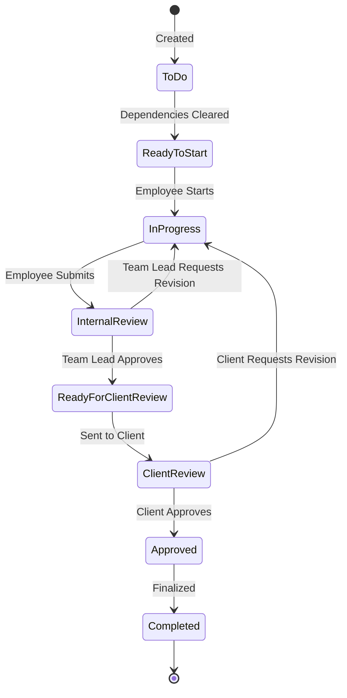

# State Machine & Permissions

## 1. Task / Deliverable Workflow (State Machine)
The workflow is NOT strictly linear; it includes critical revision loops internally and from the client.

## 2. Permission Matrix (Who triggers what?)
| Action / Transition | Allowed Roles |
| :--- | :--- |
| Create Deliverable/Task | Account Manager, Management |
| Move to `In Progress` | Employee (Assignee) |
| Submit for `Internal Review` | Employee (Assignee) |
| Approve Internal / Request Revision | Team Lead |
| Send to `Client Review` | Team Lead, Account Manager |
| Approve / Request Client Revision | Client |
| Submit New Request | Client |
| Classify as `Extra Request` | Account Manager |

## 3. Extra Requests & Billing (Out of Scope)
- When a Deliverable exceeds the contract quota, it is flagged as an **Extra Request**.
- An Account Manager can approve it as `Free Extra` or `Paid Extra`.
- **CRITICAL RULE**: Invoicing, Payments, and Billing are **OUT OF SCOPE** for v1. Approving as `Paid Extra` simply allows the task to enter the normal workflow for tracking; the actual billing is handled outside the system.

## 4. Project-Based Progress Calculation
For services like Mobile Apps or Websites, progress is calculated hierarchically, not just by state transitions.
- **Task**: 0% or 100% (Completed).
- **Feature Progress (%)**: `(Completed Tasks / Total Tasks in Feature) * 100`
- **Module Progress (%)**: `(Completed Features / Total Features in Module) * 100`
- **Project Progress (%)**: `(Completed Modules / Total Modules) * 100`

## 5. Notification Routing Matrix
| Trigger Event | Recipients |
| :--- | :--- |
| Task Assigned | Assignee (Employee) |
| Task Unblocked / Ready | Assignee (Employee) |
| Submitted for Internal Review | Team Lead |
| Internal Revision Requested | Assignee (Employee) |
| Ready for Client Review | Account Manager |
| Deliverable Available for Review| Client |
| Client Revision Requested | Assignee, Team Lead, Account Manager |
| Client Approved | Assignee, Team Lead, Account Manager |
| Task is Late | Assignee, Team Lead, Management |
| New Client Comment | Assignee, Account Manager |
