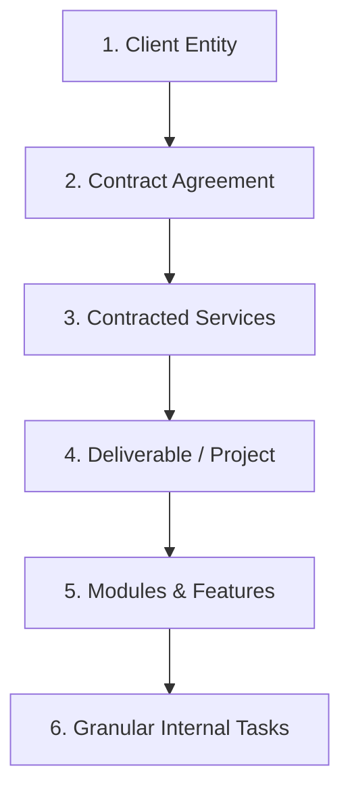

# 📘 Task Manager — The Complete System & UI Encyclopedia

> **Project Name**: Task Manager (Agency / Service Delivery Management System)  
> **Target Framework**: Flutter (Dart 3.12+)  
> **State Management**: Flutter Riverpod + StateNotifier / ValueNotifier  
> **Navigation**: GoRouter (IndexedStack StatefulShellRoute + Slide Transitions)  
> **Styling & UI**: Flutter ScreenUtil + Custom Glassmorphism Design System  
> **Hardware / Native Integrations**: Native Speech-to-Text (`talk_it`), Haptic Feedback, Local Storage (`shared_preferences`)  
> **Internationalization**: Full Bidirectional LTR / RTL (English `en` & Arabic `ar`)

---

## 📑 Master Table of Contents

1. [Project Structure & File Topology](#1-project-structure--file-topology)
2. [Business Domain & Agency Workflow Architecture](#2-business-domain--agency-workflow-architecture)
   - 2.1 [Agency Structural Hierarchy](#21-agency-structural-hierarchy)
   - 2.2 [10-State Linear Workflow State Machine](#22-10-state-linear-workflow-state-machine)
   - 2.3 [Delay Accountability & Bottleneck Tracking](#23-delay-accountability--bottleneck-tracking)
   - 2.4 [Comment Separation (Internal vs Client)](#24-comment-separation-internal-vs-client)
   - 2.5 [Version History & Revision Auditing](#25-version-history--revision-auditing)
   - 2.6 [Contract Quota Consumption Invariant](#26-contract-quota-consumption-invariant)
3. [Design System & Token Blueprint](#3-design-system--token-blueprint)
   - 3.1 [Color Palette (`AppColors`)](#31-color-palette-appcolors)
   - 3.2 [Gradients & Shadows](#32-gradients--shadows)
   - 3.3 [Typography Scale (`AppTextStyle`)](#33-typography-scale-apptextstyle)
4. [App Shell & Navigation (`AppRoutes` & `HomeLayoutView`)](#4-app-shell--navigation-approutes--homelayoutview)
5. [Screen 1: Animated Splash Screen (`SplashView`)](#5-screen-1-animated-splash-screen-splashview)
6. [Screen 2: Home Dashboard (`HomeView`)](#6-screen-2-home-dashboard-homeview)
7. [Screen 3: Daily Timeline Screen (`TimelineView`)](#7-screen-3-daily-timeline-screen-timelineview)
8. [Screen 4: All Tasks Screen (`AllTasksView`)](#8-screen-4-all-tasks-screen-alltasksview)
9. [Screen 5: Profile & Settings Screen (`SettingsView`)](#9-screen-5-profile--settings-screen-settingsview)
10. [Screen 6: Create Task Studio (`CreateTaskView`)](#10-screen-6-create-task-studio-createtaskview)
11. [Screen 7: Notifications Center (`NotificationsView`)](#11-screen-7-notifications-center-notificationsview)
12. [Screen 8: Task Detail & Workflow Hub (`TaskDetailView`) — NEW](#12-screen-8-task-detail--workflow-hub-taskdetailview--new)
13. [Modals, Bottom Sheets & Dialogs](#13-modals-bottom-sheets--dialogs)
14. [Complete Localization Reference (English & Arabic)](#14-complete-localization-reference-english--arabic)
15. [Testing & Quality Assurance Guidelines](#15-testing--quality-assurance-guidelines)

---

## 1. Project Structure & File Topology

```
task_manager/
├── lib/
│   ├── main.dart                          # App Entrypoint
│   ├── app/
│   │   └── task_app.dart                  # ScreenUtilInit, MaterialApp.router, ThemeData
│   ├── core/
│   │   ├── constants/
│   │   │   └── app_images.dart            # Asset strings
│   │   ├── localization/
│   │   │   └── locale_provider.dart       # Riverpod locale notifier & persistence
│   │   ├── models/
│   │   │   ├── task_status.dart           # 10-state workflow enum & properties
│   │   │   ├── waiting_on.dart            # Delay attribution enum (client/team)
│   │   │   ├── service_model.dart         # Service & quota model
│   │   │   ├── comment_model.dart         # Internal & client comments model
│   │   │   └── task_version_model.dart    # Version history model
│   │   ├── routes/
│   │   │   ├── app_routes.dart            # GoRouter configuration
│   │   │   └── routes_name.dart           # Central route names
│   │   ├── services/
│   │   │   └── storage_service.dart       # SharedPreferences provider wrapper
│   │   ├── theme/
│   │   │   ├── app_colors.dart            # Design tokens & color palette
│   │   │   ├── app_text_style.dart        # Typography scale
│   │   │   └── app_theme.dart             # ThemeData definition
│   │   └── widgets/
│   │       ├── background_gradiant.dart   # Ambient background gradient
│   │       └── custom_bottom_nav_bar.dart # Floating frosted bottom nav bar
│   ├── features/
│   │   ├── splash/                        # Screen 1: Splash Screen
│   │   ├── home/                          # Screen 2: Home Dashboard
│   │   ├── timeline/                      # Screen 3: Daily Timeline
│   │   ├── all_tasks/                     # Screen 4: All Tasks Screen
│   │   ├── settings/                      # Screen 5: Settings & Profile
│   │   ├── task/                          # Screen 6: Create Task Studio
│   │   ├── notifications/                 # Screen 7: Notifications Center
│   │   └── task_detail/                   # Screen 8: Task Detail & Workflow Hub
│   ├── generated/                         # Intl generated accessors (l10n.dart)
│   └── l10n/                              # ARB translation files (intl_en, intl_ar)
└── test/
    └── widget_test.dart                   # Unit & Widget tests
```

---

## 2. Business Domain & Agency Workflow Architecture

### 2.1 Agency Structural Hierarchy


### 2.2 10-State Linear Workflow State Machine
```
[To Do] ──> [Ready to Start] ──> [In Progress] ──> [Internal Review]
                                                      │           │
                    ┌─── [Internal Revision Requested] ┘           └──> [Ready for Client Review]
                    ▼                                                              │
              [In Progress]                                                        ▼
                    ▲                                                       [Client Review]
                    │                                                              │
                    └─── [Client Revision Requested] ──────────────────────────────┘
                                                                                   ▼
                                                                               [Approved]
                                                                                   │
                                                                                   ▼
                                                                              [Completed]
```

### 2.3 Delay Accountability & Bottleneck Tracking
* `WaitingOn.client`: Identifies that delivery is paused due to client actions (files missing, feedback pending). The employee accountability timer is paused.
* `WaitingOn.team`: Identifies that delivery is waiting on internal dependencies (e.g. backend deployment, design approval).

### 2.4 Comment Separation (Internal vs Client)
* `CommentModel.isClientVisible == false`: Internal conversations restricted to agency staff.
* `CommentModel.isClientVisible == true`: Client-facing correspondence.

### 2.5 Version History & Revision Auditing
* Every revision automatically increments the deliverable version (`v1`, `v2`, `v3`). Old versions are permanently archived with uploader metadata and revision notes.

### 2.6 Contract Quota Consumption Invariant
* Deliverables only count towards contracted quotas (e.g., `1 of 5 Designs`) upon reaching `Approved` or `Completed` status.

---

## 3. Design System & Token Blueprint

### 3.1 Color Palette (`AppColors`)
* `AppColors.primary`: `#FFB08A` (Peach Brand Accent)
* `AppColors.primaryLight`: `#FFD4BF`
* `AppColors.background`: `#0A0B0D` (Dark Viewport)
* `AppColors.surfaceCard`: `#202124` (Frosted Surface)
* `AppColors.surfaceSoft`: `#242526`
* `AppColors.success`: `#8CFF7A` (Green)
* `AppColors.danger`: `#FF6B6B` (Red - Blocked & Revisions)
* `AppColors.warning`: `#FFC46B` (Amber - Reviews & Deadlines)
* `AppColors.activeDot`: `#9DFF8F` (Glow indicator)

### 3.2 Gradients & Shadows
* `AppColors.softPeachGradient`: 4-stop vertical gradient from peach `#FFC5A8` to pure `#000000`.

### 3.3 Typography Scale (`AppTextStyle`)
* Built on **Inter** typography with strict line heights and tracking.

---

## 4. App Shell & Navigation (`AppRoutes` & `HomeLayoutView`)

* `RoutesName.splashScreen`: `/`
* `RoutesName.homeScreen`: `/home` (Tab 0)
* `RoutesName.timelineScreen`: `/timeline` (Tab 1)
* `RoutesName.allTasksScreen`: `/all-tasks` (Tab 2)
* `RoutesName.settingsScreen`: `/settings` (Tab 3)
* `RoutesName.createTaskScreen`: `/create-task` (Slide Up)
* `RoutesName.taskDetailScreen`: `/task-detail` (Slide Up)
* `RoutesName.notificationsScreen`: `/notifications` (Slide Right)

---

## 5. Screen 1: Animated Splash Screen (`SplashView`)
* Ambient rotating glow with seamless transition to `/home`.

---

## 6. Screen 2: Home Dashboard (`HomeView`)
* Staggered greeting header with unread notification badge.
* Dynamic task summary counters.
* Expandable search bar.
* Home task cards with:
  - Status pill badge.
  - Waiting on badge.
  - Blocked-by alert (`Icons.lock_outline_rounded`).
  - Card tap pushing `/task-detail`.

---

## 7. Screen 3: Daily Timeline Screen (`TimelineView`)
* Interactive daily schedule with vertical connectors and task time intervals.

---

## 8. Screen 4: All Tasks Screen (`AllTasksView`)
* 6 workflow filter chips:
  1. `Today`
  2. `Ready to Start`
  3. `In Progress`
  4. `Blocked`
  5. `Revisions`
  6. `Waiting for Review`
* Task cards displaying status pill, waiting-on badge, blocked-by line, and task detail tap navigation.

---

## 9. Screen 5: Profile & Settings Screen (`SettingsView`)
* User profile summary with KPI metrics.
* Language selection modal (English / Arabic) with instant reactive theme and SharedPreferences storage.

---

## 10. Screen 6: Create Task Studio (`CreateTaskView`)
* Modular GlobalKey architecture:
  - `AssignPeople` section.
  - `Client Carousel` with 3D liquid animated cards.
  - `Service Carousel` with live quota badges (`3/5`, `62%`).
  - `Task Dependency Row` with bottom sheet task picker.
  - `Timer & Date Suite` with progressive time pickers.
  - `Content Editor` with TalkIt speech-to-text and checklist.
  - `Success Dialog` displaying complete task recap.

---

## 11. Screen 7: Notifications Center (`NotificationsView`)
* Automated notifications with `NotificationType` mapping:
  - Task unblocked, revisions requested, client approvals, comments, and late alerts.

---

## 12. Screen 8: Task Detail & Workflow Hub (`TaskDetailView`) — NEW
* Dedicated workflow hub:
  1. `TaskDetailHeader`: Title, client/service subtitle, status pill.
  2. `TaskStatusStepper`: Horizontal linear stage stepper with pulsing active stage.
  3. `TaskDetailMetaCard`: Category, due date, waiting-on chip, blocked-by banner, description.
  4. `TaskVersionHistory`: Vertical timeline with `TaskVersionTile`s detailing revisions.
  5. `TaskCommentsSection`: Tabbed `Internal` vs `Client` comments with quick reply input.
  6. `TaskActionButtons`: State machine driven action CTAs.

---

## 13. Modals, Bottom Sheets & Dialogs
* `CreateTaskAssignPeopleBottomSheet`
* `CreateTaskDependencyBottomSheet`
* `CreateTaskContentBottomSheet`
* `LanguageSelectorModalSheet`
* `CreateTaskSuccessDialog`

---

## 14. Complete Localization Reference (English & Arabic)
* 65+ bilingual keys across `intl_en.arb` and `intl_ar.arb` with full RTL layout mirroring.

---

## 15. Testing & Quality Assurance Guidelines

* **ScreenUtil Testing Invariant**: Always initialize test physical viewports:
  ```dart
  tester.view.physicalSize = const Size(1125, 2436);
  tester.view.devicePixelRatio = 3.0;
  addTearDown(tester.view.resetPhysicalSize);
  addTearDown(tester.view.resetDevicePixelRatio);
  ```
