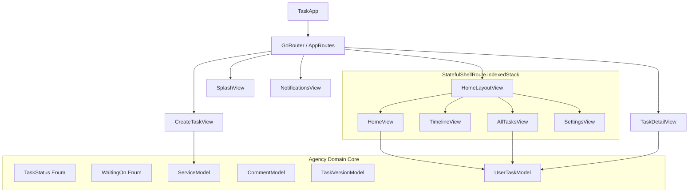
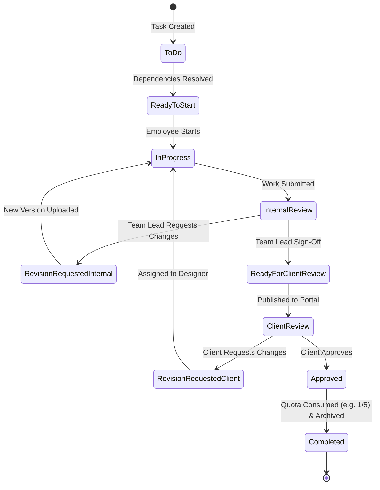

# Task Manager — Exhaustive Technical & UI Screens Specification

> **Document Version**: 4.0.0 (Master Edition)  
> **Target Framework**: Flutter (Dart 3.12+)  
> **Architecture**: Feature-First Clean Architecture + Riverpod + GoRouter + ScreenUtil  
> **Target Viewport Baseline**: 375.w × 812.h (iPhone / Modern Android Standard)  
> **Platforms Supported**: iOS, Android, Web, macOS, Windows  
> **Last Updated**: August 2026

---

## 📑 Master Table of Contents

1. [Architectural Blueprint & Layer Breakdown](#1-architectural-blueprint--layer-breakdown)
2. [Global Design Tokens, Surfaces & Geometry](#2-global-design-tokens-surfaces--geometry)
   - 2.1 [Color Palette Matrix (`AppColors`)](#21-color-palette-matrix-appcolors)
   - 2.2 [Gradients, Ambient Glows & BoxShadows](#22-gradients-ambient-glows--boxshadows)
   - 2.3 [Typography Scale & Metrics (`AppTextStyle`)](#23-typography-scale--metrics-apptextstyle)
   - 2.4 [Radii & Spacing Grid](#24-radii--spacing-grid)
3. [Business Domain, Agency Hierarchy & State Machine](#3-business-domain-agency-hierarchy--state-machine)
   - 3.1 [6-Tier Agency Structure](#31-6-tier-agency-structure)
   - 3.2 [10-State Linear Workflow State Machine (`TaskStatus`)](#32-10-state-linear-workflow-state-machine-taskstatus)
   - 3.3 [Delay Accountability & Timer Attribution (`WaitingOn`)](#33-delay-accountability--timer-attribution-waitingon)
   - 3.4 [Dual-Audience Comment Privacy Model (`CommentModel`)](#34-dual-audience-comment-privacy-model-commentmodel)
   - 3.5 [Immutable Version History & Revision Audit (`TaskVersionModel`)](#35-immutable-version-history--revision-audit-taskversionmodel)
   - 3.6 [Quota Consumption & Milestone Tracking (`ServiceModel`)](#36-quota-consumption--milestone-tracking-servicemodel)
   - 3.7 [Extended Task Aggregate (`UserTaskModel`)](#37-extended-task-aggregate-usertaskmodel)
4. [Global Shell, Navigation & Routes](#4-global-shell-navigation--routes)
   - 4.1 [Route Definitions & Transitions (`AppRoutes`, `RoutesName`)](#41-route-definitions--transitions-approutes-routesname)
   - 4.2 [Shell Wrapper (`HomeLayoutView`)](#42-shell-wrapper-homelayoutview)
   - 4.3 [Frosted Bottom Navigation Bar (`CustomBottomNavBar`)](#43-frosted-bottom-navigation-bar-custombottomnavbar)
5. [Screen 1: Animated Splash Screen (`SplashView`)](#5-screen-1-animated-splash-screen-splashview)
6. [Screen 2: Home Dashboard (`HomeView`)](#6-screen-2-home-dashboard-homeview)
   - 6.1 [Greeting & Bell Header (`Header`)](#61-greeting--bell-header-header)
   - 6.2 [Interactive Task Summary (`TaskSummary`)](#62-interactive-task-summary-tasksummary)
   - 6.3 [Frosted Search Input & Tune (`SearchBox`)](#63-frosted-search-input--tune-searchbox)
   - 6.4 [Segmented Filter Control (`TasksHeader` & `FilterButton`)](#64-segmented-filter-control-tasksheader--filterbutton)
   - 6.5 [Staggered Task List & Cards (`HomeTasksList` & `TaskCard`)](#65-staggered-task-list--cards-hometaskslist--taskcard)
7. [Screen 3: Daily Timeline Screen (`TimelineView`)](#7-screen-3-daily-timeline-screen-timelineview)
   - 7.1 [Timeline Header & Date Pill (`TimelineHeader`)](#71-timeline-header--date-pill-timelineheader)
   - 7.2 [Interactive Connected Node Tile (`TimelineTile`)](#72-interactive-connected-node-tile-timelinetile)
   - 7.3 [Timeline Schedule Dataset](#73-timeline-schedule-dataset)
8. [Screen 4: All Tasks Screen (`AllTasksView`)](#8-screen-4-all-tasks-screen-alltasksview)
   - 8.1 [Header Counter (`AllTasksHeader`)](#81-header-counter-alltasksheader)
   - 8.2 [6-Workflow Filter Chips Bar (`AllTasksFilterChips`)](#82-6-workflow-filter-chips-bar-alltasksfilterchips)
   - 8.3 [Agency Task Card (`AllTasksCard`)](#83-agency-task-card-alltaskscard)
   - 8.4 [Filtered Task List (`AllTasksList`)](#84-filtered-task-list-alltaskslist)
9. [Screen 5: Profile & Settings Screen (`SettingsView`)](#9-screen-5-profile--settings-screen-settingsview)
   - 9.1 [Settings Header (`SettingsHeader`)](#91-settings-header-settingsheader)
   - 9.2 [User Profile Card & KPI Badges (`SettingsProfileCard`)](#92-user-profile-card--kpi-badges-settingsprofilecard)
   - 9.3 [Preferences Section (`SettingsPreferencesSection`)](#93-preferences-section-settingspreferencessection)
   - 9.4 [Account & Security Section (`SettingsSecuritySection`)](#94-account--security-section-settingssecuritysection)
   - 9.5 [Settings Tile Primitive (`SettingsTile`)](#95-settings-tile-primitive-settingstile)
10. [Screen 6: Create Task Studio (`CreateTaskView`)](#10-screen-6-create-task-studio-createtaskview)
    - 10.1 [Modular GlobalKey Architecture](#101-modular-globalkey-architecture)
    - 10.2 [Header Bar with AM/PM Switch (`CreateTaskViewHeader`)](#102-header-bar-with-ampm-switch-createtaskviewheader)
    - 10.3 [Assign People Section (`CreateTaskViewAssignPeople`)](#103-assign-people-section-createtaskviewassignpeople)
    - 10.4 [Client Carousel (`CreateTaskViewCompany` & `CreateTaskViewCompanyCard`)](#104-client-carousel-createtaskviewcompany--createtaskviewcompanycard)
    - 10.5 [Service Carousel & Quotas (`CreateTaskViewService` & `CreateTaskViewServiceCard`)](#105-service-carousel--quotas-createtaskviewservice--createtaskviewservicecard)
    - 10.6 [Task Dependency Row (`CreateTaskViewDependency`)](#106-task-dependency-row-createtaskviewdependency)
    - 10.7 [Progressive Date & Time Suite (`CreateTaskViewTimer` & Subcomponents)](#107-progressive-date--time-suite-createtaskviewtimer--subcomponents)
    - 10.8 [Rich Content & TalkIt Voice Dictation (`CreateTaskViewContent`)](#108-rich-content--talkit-voice-dictation-createtaskviewcontent)
    - 10.9 [Save Action Button & Validation (`CreateTaskSaveButton`)](#109-save-action-button--validation-createtasksavebutton)
11. [Screen 7: Notifications Center (`NotificationsView`)](#11-screen-7-notifications-center-notificationsview)
    - 11.1 [Unread Counter Header (`NotificationsHeader`)](#111-unread-counter-header-notificationsheader)
    - 11.2 [Automated Notification Type System (`NotificationType`)](#112-automated-notification-type-system-notificationtype)
    - 11.3 [Notification Tile & Feed (`NotificationsList` & `NotificationTile`)](#113-notification-tile--feed-notificationslist--notificationtile)
12. [Screen 8: Task Detail & Multi-Stage Hub (`TaskDetailView`)](#12-screen-8-task-detail--multi-stage-hub-taskdetailview)
    - 12.1 [Detail Header & Hierarchy Subtitle (`TaskDetailHeader`)](#121-detail-header--hierarchy-subtitle-taskdetailheader)
    - 12.2 [Pulsing Horizontal Workflow Stepper (`TaskStatusStepper`)](#122-pulsing-horizontal-workflow-stepper-taskstatusstepper)
    - 12.3 [Metadata, Waiting-On & Blocked Banner (`TaskDetailMetaCard`)](#123-metadata-waiting-on--blocked-banner-taskdetailmetacard)
    - 12.4 [Version History & Revision Audit Trail (`TaskVersionHistory` & `TaskVersionTile`)](#124-version-history--revision-audit-trail-taskversionhistory--taskversiontile)
    - 12.5 [Internal vs Client Comments Tabs (`TaskCommentsSection` & `TaskCommentTile`)](#125-internal-vs-client-comments-tabs-taskcommentssection--taskcommenttile)
    - 12.6 [Dynamic State Machine Action CTAs (`TaskActionButtons`)](#126-dynamic-state-machine-action-ctas-taskactionbuttons)
13. [Modals, Bottom Sheets & Dialogs Deep Dive](#13-modals-bottom-sheets--dialogs-deep-dive)
    - 13.1 [Assign People Bottom Sheet (`CreateTaskAssignPeopleBottomSheet`)](#131-assign-people-bottom-sheet-createtaskassignpeoplebottomsheet)
    - 13.2 [Task Dependency Picker Bottom Sheet (`CreateTaskDependencyBottomSheet`)](#132-task-dependency-picker-bottom-sheet-createtaskdependencybottomsheet)
    - 13.3 [Task Content Fullscreen Editor (`CreateTaskContentBottomSheet`)](#133-task-content-fullscreen-editor-createtaskcontentbottomsheet)
    - 13.4 [Language Selection Modal Sheet](#134-language-selection-modal-sheet)
    - 13.5 [Task Created Confirmation Dialog (`CreateTaskSuccessDialog`)](#135-task-created-confirmation-dialog-createtasksuccessdialog)
14. [Exhaustive i18n Localization Key Dictionary](#14-exhaustive-i18n-localization-key-dictionary)
15. [Testing & Quality Assurance Invariants](#15-testing--quality-assurance-invariants)

---

## 1. Architectural Blueprint & Layer Breakdown

The application strictly adheres to a **Feature-Driven Layered Architecture**:

```
lib/
├── app/                        # Application configuration, initialization & entry
│   └── task_app.dart           # ScreenUtilInit, MaterialApp.router, theme & localization setup
├── core/                       # Shared / cross-cutting infrastructure
│   ├── constants/              # Global constants (AppImages)
│   ├── localization/           # Locale state notifier & persistence
│   ├── models/                 # Shared agency domain models (TaskStatus, WaitingOn, ServiceModel, etc.)
│   ├── routes/                 # Navigation, GoRouter configuration & route names
│   ├── services/               # SharedPreferences and hardware interfaces
│   ├── theme/                  # Colors (AppColors), Typography (AppTextStyle), ThemeData (AppTheme)
│   └── widgets/                # Reusable global widgets (CustomBottomNavBar, BackgroundGradiant)
├── features/                   # Business domain features
│   ├── splash/                 # Screen 1: Splash Screen
│   ├── home/                   # Screen 2: Home Dashboard
│   ├── timeline/               # Screen 3: Daily Timeline
│   ├── all_tasks/              # Screen 4: All Tasks Screen
│   ├── settings/               # Screen 5: Settings & Profile
│   ├── task/                   # Screen 6: Create Task Studio
│   ├── notifications/          # Screen 7: Notifications Center
│   └── task_detail/            # Screen 8: Task Detail & Multi-Stage Hub
├── generated/                  # Localization code-gen output (l10n.dart, messages_*.dart)
└── l10n/                       # ARB localization files (intl_en.arb, intl_ar.arb)
```



---

## 2. Global Design Tokens, Surfaces & Geometry

### 2.1 Color Palette Matrix (`AppColors`)

Defined in [`lib/core/theme/app_colors.dart`](file:///E:/C/production%20projects/task_manager/task_manager/lib/core/theme/app_colors.dart):

| Token Constant | Hex Code | ARGB Value | Usage & Visual Semantics |
| :--- | :--- | :--- | :--- |
| `AppColors.primary` | `#FFB08A` | `0xFFFFB08A` | Main Brand Peach Accent. Selected tabs, primary CTA buttons, active timeline nodes, FAB gradient. |
| `AppColors.primaryLight` | `#FFD4BF` | `0xFFFFD4BF` | Light Peach. Timeline tags, progressive time picker handle, client subtitle text. |
| `AppColors.primaryDark` | `#C98468` | `0xFFC98468` | Deep Peach. Progressive time picker end handle, active borders. |
| `AppColors.background` | `#0A0B0D` | `0xFF0A0B0D` | Base dark viewport background. |
| `AppColors.backgroundDeep`| `#030304` | `0xFF030304` | Pitch black background for high contrast icons and CTA text. |
| `AppColors.navyDark` | `#111827` | `0xFF111827` | Slate navy stop inside the global ambient peach background gradient. |
| `AppColors.surface` | `#1D1D1D` | `0xFF1D1D1D` | Modal bottom sheets, date picker container background, dialog background. |
| `AppColors.surfaceSoft` | `#242526` | `0xFF242526` | Card fill containers, input box fill, language selection card background. |
| `AppColors.surfaceLight` | `#303134` | `0xFF303134` | Sub-chips, circular avatar background, snackbar background. |
| `AppColors.surfaceCard` | `#202124` | `0xFF202124` | Frosted container card backgrounds, task tile containers, notification cards. |
| `AppColors.textPrimary` | `#FFFFFF` | `0xFFFFFFFF` | Pure white typography for headlines, titles, active labels. |
| `AppColors.textSecondary` | `#A7A7A7` | `0xFFA7A7A7` | Medium light gray for descriptions, subheadings, unselected labels. |
| `AppColors.textMuted` | `#6F7074` | `0xFF6F7074` | Muted charcoal gray for placeholders, timestamps, item counts. |
| `AppColors.textDark` | `#111111` | `0xFF111111` | Jet black typography when placed on top of light cards or primary chips. |
| `AppColors.success` | `#8CFF7A` | `0xFF8CFF7A` | Vibrant green for completed status checkmarks and completed deliverable badges. |
| `AppColors.danger` | `#FF6B6B` | `0xFFFF6B6B` | Bright red for blocked tasks, revision requests, logout button, error SnackBars. |
| `AppColors.warning` | `#FFC46B` | `0xFFFFC46B` | Amber orange for internal/client review stages, waiting on client, approaching deadlines. |
| `AppColors.border` | `#3A3A3A` | `0xFF3A3A3A` | Neutral border outline for containers and avatar rings. |
| `AppColors.borderLight` | `#E8E8E8` | `0xFFE8E8E8` | Subtle light border overlay with low opacity alpha (`0.08` - `0.10`). |
| `AppColors.activeDot` | `#9DFF8F` | `0xFF9DFF8F` | Active glowing filter dot, task approval indicator. |

### 2.2 Gradients, Ambient Glows & BoxShadows

* **`AppColors.softPeachGradient`**:
  ```dart
  LinearGradient(
    begin: Alignment.topCenter,
    end: Alignment.bottomCenter,
    colors: [Color(0xFFFFC5A8), Color(0xFFB98775), Color(0xFF111827), Colors.black],
    stops: [0.0, 0.3, 0.7, 1.0],
  )
  ```
* **`AppColors.mainGradient`**:
  ```dart
  LinearGradient(
    begin: AlignmentDirectional.topCenter,
    end: AlignmentDirectional.bottomStart,
    colors: [primary, Color(0xFF14161E), Color(0xFF08090D), Color(0xFF000000), Color(0xFF17191D)],
    stops: [0.0, 0.25, 0.52, 0.78, 1.0],
  )
  ```
* **Shadow Tokens**:
  * `AppColors.shadowLight`: `Color(0x2E000000)` (18% black shadow for soft floating controls).
  * `AppColors.shadowDark`: `Color(0x59000000)` (35% black shadow for deep elevation on task cards).

### 2.3 Typography Scale & Metrics (`AppTextStyle`)

Typography is anchored to the **Inter** font family with precise tracking and line-heights:

| Style Name | Size (`sp`) | Weight | Line Height | Tracking | Foreground Color |
| :--- | :--- | :--- | :--- | :--- | :--- |
| `displayLarge` | 34 | `FontWeight.w800` | 1.10 | -1.1 | `AppColors.textPrimary` |
| `headlineLarge` | 28 | `FontWeight.w800` | 1.15 | -0.8 | `AppColors.textPrimary` |
| `headlineMedium`| 24 | `FontWeight.w700` | 1.20 | -0.5 | `AppColors.textPrimary` |
| `titleLarge` | 20 | `FontWeight.w700` | 1.25 | -0.3 | `AppColors.textPrimary` |
| `titleMedium` | 16 | `FontWeight.w700` | 1.30 | 0.0 | `AppColors.textPrimary` |
| `titleSmall` | 14 | `FontWeight.w600` | 1.30 | 0.0 | `AppColors.textPrimary` |
| `bodyLarge` | 15 | `FontWeight.w500` | 1.45 | 0.0 | `AppColors.textPrimary` |
| `bodyMedium` | 13 | `FontWeight.w400` | 1.45 | 0.0 | `AppColors.textSecondary` |
| `bodySmall` | 11 | `FontWeight.w400` | 1.35 | 0.0 | `AppColors.textMuted` |
| `labelLarge` | 14 | `FontWeight.w700` | 1.00 | 0.0 | `AppColors.textDark` |
| `labelMedium` | 12 | `FontWeight.w600` | 1.00 | 0.0 | `AppColors.textPrimary` |
| `chip` | 10 | `FontWeight.w700` | 1.00 | 0.0 | `AppColors.textDark` |
| `button` | 13 | `FontWeight.w800` | 1.00 | 0.0 | `AppColors.textDark` |

---

## 3. Business Domain, Agency Hierarchy & State Machine

### 3.1 6-Tier Agency Structure
1. **Client**: The company account (e.g. "Al-Noor Retail", "Nacho Brand", "Apex Health").
2. **Contract**: Time-bound engagement defining terms and monthly allocations.
3. **Services**:
   - *Quantity-Based*: Counted quota deliverables (e.g., 5 Designs/mo, 12 Posts/mo).
   - *Project-Based*: Milestone % progress (e.g., Mobile App Development 62%, Website 40%).
4. **Deliverables / Projects**: High-level deliverables received by the client.
5. **Modules & Features**: Intermediate grouping of technical work.
6. **Internal Tasks**: Granular execution steps hidden from the client portal.

### 3.2 10-State Linear Workflow State Machine (`TaskStatus`)

Defined in [`lib/core/models/task_status.dart`](file:///E:/C/production%20projects/task_manager/task_manager/lib/core/models/task_status.dart):



### 3.3 Delay Accountability & Timer Attribution (`WaitingOn`)

Defined in [`lib/core/models/waiting_on.dart`](file:///E:/C/production%20projects/task_manager/task_manager/lib/core/models/waiting_on.dart):
* `WaitingOn.client`: Pauses employee accountability timers. Reports attribute timeline delay directly to the client (e.g. waiting on logos, feedback, brief).
* `WaitingOn.team`: Flags internal dependencies causing delay (e.g. waiting for API endpoint deployment).
* `WaitingOn.none`: Normal delivery flow.

### 3.4 Dual-Audience Comment Privacy Model (`CommentModel`)

Defined in [`lib/core/models/comment_model.dart`](file:///E:/C/production%20projects/task_manager/task_manager/lib/core/models/comment_model.dart):
* `isClientVisible == false`: **Internal notes** visible strictly to agency personnel.
* `isClientVisible == true`: **Client-facing messages** synchronized with the client portal.

### 3.5 Immutable Version History & Revision Audit (`TaskVersionModel`)

Defined in [`lib/core/models/task_version_model.dart`](file:///E:/C/production%20projects/task_manager/task_manager/lib/core/models/task_version_model.dart):
* Tracks `versionNumber`, `uploadedBy`, `uploadedAt`, `revisionNote`, and `approved` status.
* Versions are immutable and permanently preserved for revision tracking.

### 3.6 Quota Consumption & Milestone Tracking (`ServiceModel`)

Defined in [`lib/core/models/service_model.dart`](file:///E:/C/production%20projects/task_manager/task_manager/lib/core/models/service_model.dart):
* **Quota Consumption Rule**: A deliverable ONLY counts against contracted monthly quotas when it transitions to `Approved` / `Completed`.
* `quotaLabel`: Automatically returns `"3/5"` for counted services or `"62%"` for milestone projects.

### 3.7 Extended Task Aggregate (`UserTaskModel`)

Defined in [`lib/features/all_tasks/model/user_task_model.dart`](file:///E:/C/production%20projects/task_manager/task_manager/lib/features/all_tasks/model/user_task_model.dart):
```dart
class UserTaskModel {
  final String id;
  final String title;
  final String category;
  final String dueDate;
  bool isDone;
  final bool isUrgent;
  final Color priorityColor;
  final TaskStatus status;
  final String? blockedByTaskTitle;
  final WaitingOn waitingOn;
  final String? clientName;
  final String? serviceName;
  final List<CommentModel> comments;
  final List<TaskVersionModel> versions;
  final String? description;
}
```

---

## 4. Global Shell, Navigation & Routes

### 4.1 Route Definitions & Transitions (`AppRoutes`, `RoutesName`)

Defined in [`lib/core/routes/routes_name.dart`](file:///E:/C/production%20projects/task_manager/task_manager/lib/core/routes/routes_name.dart) and [`lib/core/routes/app_routes.dart`](file:///E:/C/production%20projects/task_manager/task_manager/lib/core/routes/app_routes.dart):

| Route Constant | Path | Transition Style | Destination View |
| :--- | :--- | :--- | :--- |
| `RoutesName.splashScreen` | `/` | Fade + Scale Down Exit (500ms) | `SplashView` |
| `RoutesName.homeScreen` | `/home` | Shell Branch 0 (NoTransitionPage) | `HomeView` |
| `RoutesName.timelineScreen` | `/timeline` | Shell Branch 1 (NoTransitionPage) | `TimelineView` |
| `RoutesName.allTasksScreen` | `/all-tasks`| Shell Branch 2 (NoTransitionPage) | `AllTasksView` |
| `RoutesName.settingsScreen` | `/settings` | Shell Branch 3 (NoTransitionPage) | `SettingsView` |
| `RoutesName.createTaskScreen`| `/create-task`| Vertical Slide Up (`Offset(0,1) -> (0,0)`) | `CreateTaskView` |
| `RoutesName.taskDetailScreen`| `/task-detail`| Vertical Slide Up (`Offset(0,1) -> (0,0)`) | `TaskDetailView` |
| `RoutesName.notificationsScreen`| `/notifications`| Horizontal Slide (`Offset(1,0) -> (0,0)`) | `NotificationsView` |

### 4.2 Shell Wrapper (`HomeLayoutView`)
* Wraps the `StatefulShellRoute.indexedStack` in a root scaffold.
* Houses the floating `CustomBottomNavBar` positioned over the view content.

### 4.3 Frosted Bottom Navigation Bar (`CustomBottomNavBar`)
* Width: `double.infinity`, Padding: `12.w horizontal, 10.h vertical`.
* Frosted glass container (`AppColors.surfaceCard` with `16%` white border, `borderRadius: 30.r`).
* Floating Center Add Button (`48.r × 48.r`, `AppColors.primary` gradient fill, `Icons.add_rounded`).
* 4 navigation tabs (`Home`, `Timeline`, `Tasks`, `Settings`) with animated indicator pills.

---

## 5. Screen 1: Animated Splash Screen (`SplashView`)
* Background: `AppColors.backgroundDeep` (`#030304`).
* Center animated logo assembly: `AppImages.circle` (rotating ambient halo) + `AppImages.tLogo` (pulsing brand character).
* Timer-triggered navigation to `/home` with custom exit transition.

---

## 6. Screen 2: Home Dashboard (`HomeView`)

### 6.1 Greeting & Bell Header (`Header`)
* Localized greeting `greetingUser(userName)`.
* Unread notification bell icon with badge directing to `/notifications`.

### 6.2 Interactive Task Summary (`TaskSummary`)
* Active tasks count pill and Completed count pill.

### 6.3 Frosted Search Input & Tune (`SearchBox`)
* Frosted container with `searchHint` and filter tune icon.

### 6.4 Segmented Filter Control (`TasksHeader` & `FilterButton`)
* Animated sliding pill segmented toggle (`Active` vs `Done`).

### 6.5 Staggered Task List & Cards (`HomeTasksList` & `TaskCard`)
* Task cards with staggered entrance slide animations:
  - Top row: Tag chips + `TaskStatus` pill badge + Date.
  - Title in `AppTextStyle.headlineMedium`.
  - Description and check toggle button.
  - Delay badge if `waitingOn != WaitingOn.none`.
  - Blocked-by alert line if `blockedByTaskTitle != null` with `Icons.lock_outline_rounded` in `AppColors.danger`.
  - Tap opens `/task-detail`.

---

## 7. Screen 3: Daily Timeline Screen (`TimelineView`)

### 7.1 Timeline Header & Date Pill (`TimelineHeader`)
* Header title `dailyTimeline`, subtitle `timelineSubtitle`, and date chip `timelineToday`.

### 7.2 Interactive Connected Node Tile (`TimelineTile`)
* Time column on the left (`68.w`).
* Connected node column: `14.r` circular indicator (filled checkmark when done, ring when pending) + connecting track line.
* Card container: category chip, duration badge, title with strikethrough upon completion.

---

## 8. Screen 4: All Tasks Screen (`AllTasksView`)

### 8.1 Header Counter (`AllTasksHeader`)
* Live counters: `{count} active` and `{count} completed`.

### 8.2 6-Workflow Filter Chips Bar (`AllTasksFilterChips`)
* Filter categories:
  1. `Today`: Tasks due today.
  2. `Ready to Start`: Unblocked tasks ready for work.
  3. `In Progress`: Tasks actively being executed.
  4. `Blocked`: Tasks blocked by a dependency.
  5. `Revisions`: Tasks with internal or client revisions requested.
  6. `Waiting for Review`: Tasks under internal or client review.

### 8.3 Agency Task Card (`AllTasksCard`)
* Circular checkbox toggle.
* Category tag + Due date.
* `WaitingOn` badge (`Waiting on Client` / `Waiting on Team`).
* Blocked-by warning in `AppColors.danger`.
* Dynamic `TaskStatus` pill badge.
* Tap pushes `TaskDetailView`.

---

## 9. Screen 5: Profile & Settings Screen (`SettingsView`)

### 9.1 Profile Header & KPI Badges (`SettingsProfileCard`)
* User avatar with edit button.
* 3 KPI metric tiles: **Tasks Done**, **Active Tasks**, and **Streak** (Days).

### 9.2 Preferences Section (`SettingsPreferencesSection`)
* Push Notifications switch toggle.
* Language selection tile showing active language (`English (US)` or `العربية (Arabic)`), opening modal sheet on tap.

### 9.3 Account & Security Section (`SettingsSecuritySection`)
* Security & PIN setting tile.
* Log Out action tile styled in `AppColors.danger`.

---

## 10. Screen 6: Create Task Studio (`CreateTaskView`)

### 10.1 Modular GlobalKey Architecture
* `_peopleKey`: `CreateTaskViewAssignPeopleState`
* `_companyKey`: `CreateTaskViewCompanyState` (Client)
* `_serviceKey`: `CreateTaskViewServiceState` (Service & quota)
* `_dependencyKey`: `CreateTaskViewDependencyState` (Dependency)
* `_timerKey`: `CreateTaskViewTimerState` (Dates & times)
* `_contentKey`: `CreateTaskViewContentState` (Description & checklist)

### 10.2 Client Carousel (`CreateTaskViewCompany` & `CreateTaskViewCompanyCard`)
* Capsule cards (`50.w × 150.h`) with 3D liquid fill/drain animations for selecting the client.

### 10.3 Service Carousel & Quotas (`CreateTaskViewService` & `CreateTaskViewServiceCard`)
* Animated capsule carousel displaying contracted services with live quota indicators (`3/5`, `62%`).

### 10.4 Task Dependency Row (`CreateTaskViewDependency`)
* Row displaying `No dependency` or `Blocked by: {taskTitle}` in red with modal task picker sheet.

### 10.5 Date & Time Suite (`CreateTaskViewTimer` & Subcomponents)
* Progressive circular time range picker (`startTime` to `endTime`).
* Date range selector.

### 10.6 Rich Content & TalkIt Voice Dictation (`CreateTaskViewContent`)
* Description input with microphone voice-to-text dictation button (`talk_it`).
* Dynamic checklist item builder with completion checkboxes.

### 10.7 Save Action Button & Success Dialog (`CreateTaskSaveButton`, `CreateTaskSuccessDialog`)
* Full-width save button (`54.h`, `16.r`, `AppColors.primary`).
* Success dialog summarizing assigned team members, client, service, dependency, dates, and checklist items.

---

## 11. Screen 7: Notifications Center (`NotificationsView`)

### 11.1 Automated Notification Type System (`NotificationType`)
* `taskUnblocked` / `approved`: `AppColors.activeDot` (Green).
* `internalRevisionRequested` / `clientRevisionRequested` / `deadlineApproaching`: `AppColors.warning` (Amber).
* `taskLate`: `AppColors.danger` (Red).
* `newComment` / `taskAssigned`: `AppColors.primary` (Peach).

### 11.2 Notification Feed & Tile (`NotificationTile`)
* Unread cards with glowing peach border and indicator dot.
* Mark all read header action.

---

## 12. Screen 8: Task Detail & Multi-Stage Hub (`TaskDetailView`)

### 12.1 Detail Header (`TaskDetailHeader`)
* Back button (`44.r × 44.r` glass container).
* Task title in `AppTextStyle.headlineMedium`.
* Subtitle: `Client Name • Service Name (Quota)`.
* Dynamic status pill badge.

### 12.2 Pulsing Horizontal Workflow Stepper (`TaskStatusStepper`)
* Horizontal stepper tracking: `To Do` → `In Progress` → `Internal Review` → `Client Review` → `Approved`.
* Current active stage pulses with glowing `AppColors.primary` shadow. Completed stages render check icons.

### 12.3 Metadata, Waiting-On & Blocked Banner (`TaskDetailMetaCard`)
* Category chip, Due date, Waiting-on badge, Blocked-by alert banner, and Task description.

### 12.4 Version History & Revision Audit Trail (`TaskVersionHistory` & `TaskVersionTile`)
* Vertical timeline showing version tags (`v1`, `v2`, `v3`), uploader names, timestamps, revision notes, and approval tags.

### 12.5 Internal vs Client Comments Tabs (`TaskCommentsSection` & `TaskCommentTile`)
* Segmented switch: **Internal** (agency-only) vs **Client** (client-facing).
* Comment feed with author avatars, badges, timestamps, and quick-reply input bar.

### 12.6 Dynamic State Machine Action CTAs (`TaskActionButtons`)
* Adapts CTA based on workflow status:
  - `To Do` / `Ready`: `"Start Working"`
  - `In Progress`: `"Submit for Internal Review"`
  - `Internal Review`: `"Approve & Send to Client"` / `"Request Internal Revision"`
  - `Client Review`: `"Client Approved"` / `"Client Requested Revision"`
  - `Revision Requested`: `"Submit New Version"`
  - `Approved`: `"Mark as Completed"`

---

## 13. Modals, Bottom Sheets & Dialogs Deep Dive

### 13.1 `CreateTaskAssignPeopleBottomSheet`
* Drag handle, title, Done button, search bar, list of people with checkmark indicators.

### 13.2 `CreateTaskDependencyBottomSheet`
* Single-select modal bottom sheet showing open tasks with search bar and "None" option.

### 13.3 `CreateTaskContentBottomSheet`
* Fullscreen editor with rich description field and checklist manager.

### 13.4 Language Selection Modal Sheet
* Bilingual selection sheet (English / Arabic) with instant reactive update.

### 13.5 `CreateTaskSuccessDialog`
* Confirmation recap modal displaying all created task parameters.

---

## 14. Exhaustive i18n Localization Key Dictionary

| ARB Key | English Translation | Arabic Translation | Usage Context |
| :--- | :--- | :--- | :--- |
| `appTitle` | Task Manager | مدير المهام | App Title |
| `navHome` | Home | الرئيسية | Bottom Nav Tab 0 |
| `navTimeline` | Timeline | الجدول الزمني | Bottom Nav Tab 1 |
| `navTasks` | Tasks | المهام | Bottom Nav Tab 2 |
| `navSettings` | Settings | الإعدادات | Bottom Nav Tab 3 |
| `navNewTask` | New Task | مهمة جديدة | Floating Center Button |
| `greetingUser` | Hey {userName}! | مرحباً {userName}! | Home Header |
| `filterToday` | Today | اليوم | All Tasks Filter Chip |
| `filterReadyToStart`| Ready to Start | جاهز للبدء | All Tasks Filter Chip |
| `filterBlocked` | Blocked | معلّق | All Tasks Filter Chip |
| `filterRevisions` | Revisions | تعديلات | All Tasks Filter Chip |
| `filterWaitingReview`| Waiting for Review | بانتظار المراجعة | All Tasks Filter Chip |
| `statusToDo` | To Do | قيد الانتظار | Status Label |
| `statusReadyToStart`| Ready to Start | جاهز للبدء | Status Label |
| `statusInProgress` | In Progress | قيد التنفيذ | Status Label |
| `statusInternalReview`| Internal Review | مراجعة داخلية | Status Label |
| `statusRevisionInternal`| Revision (Internal) | تعديل داخلي | Status Label |
| `statusReadyForClientReview`| Ready for Client | جاهز للعميل | Status Label |
| `statusClientReview`| Client Review | مراجعة العميل | Status Label |
| `statusRevisionClient`| Revision (Client) | تعديل مطلوب من العميل | Status Label |
| `statusApproved` | Approved | معتمد | Status Label |
| `statusCompleted` | Completed | مكتمل | Status Label |
| `waitingOnClient` | Waiting on Client | بانتظار العميل | Delay Badge |
| `waitingOnTeam` | Waiting on Team | بانتظار الفريق | Delay Badge |
| `taskDetailTitle` | Task Detail | تفاصيل المهمة | Detail Screen Header |
| `internalComments` | Internal | داخلي | Comments Tab |
| `clientComments` | Client | العميل | Comments Tab |
| `versionHistory` | Version History | سجل الإصدارات | Version Section Header |
| `submitInternalReview`| Submit for Internal Review | إرسال للمراجعة الداخلية | Action CTA |
| `approveAndSendToClient`| Approve & Send to Client | اعتماد وإرسال للعميل | Action CTA |
| `requestRevision` | Request Revision | طلب تعديل | Action CTA |
| `blockedBy` | Blocked by: {taskTitle} | معلّق بسبب: {taskTitle} | Blocked Alert |
| `service` | Service: | الخدمة: | Service Label |
| `noDependency` | No dependency | بدون اعتمادية | Dependency Row |

---

## 15. Testing & Quality Assurance Invariants

1. **ScreenUtil Viewport Invariant**:
   In all widget tests involving `flutter_screenutil`, initialize the tester's viewport dimensions:
   ```dart
   tester.view.physicalSize = const Size(1125, 2436);
   tester.view.devicePixelRatio = 3.0;
   addTearDown(tester.view.resetPhysicalSize);
   addTearDown(tester.view.resetDevicePixelRatio);
   ```
2. **Localization Sync Invariant**:
   Whenever ARB keys are modified in `lib/l10n/`, keep `lib/generated/l10n.dart` and `messages_*.dart` synchronized.
